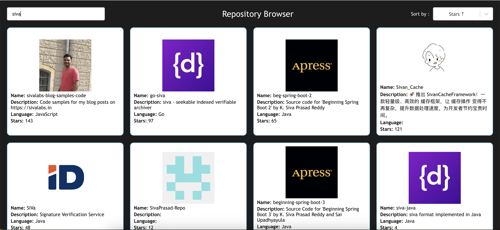
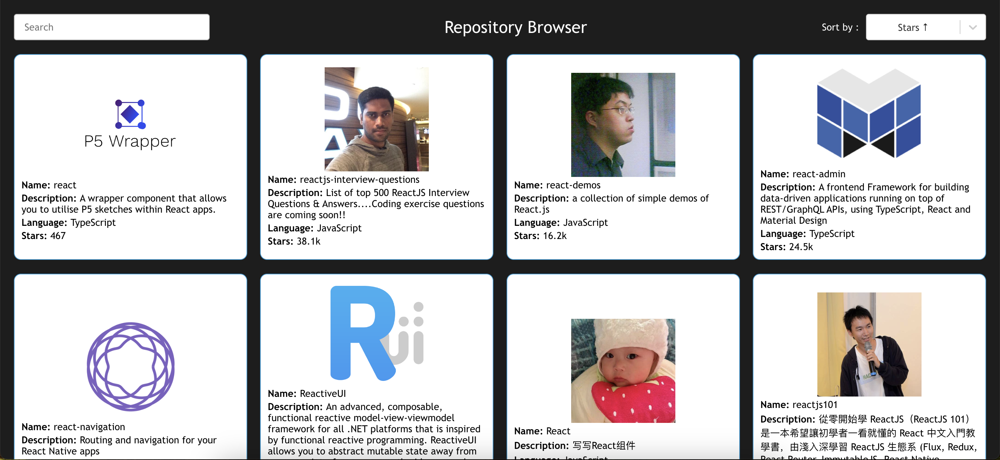
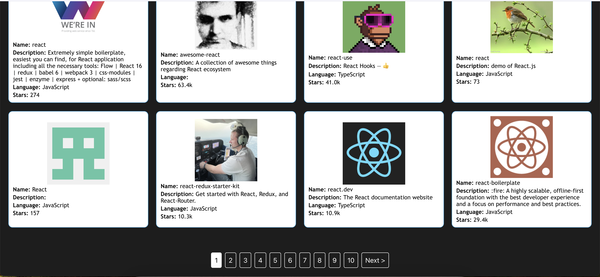

# Getting Started with Create React App

This project was bootstrapped with [Create React App](https://github.com/facebook/create-react-app).

## Step 1: Setup Instructions:

Clone the repository:
git clone https://github.com/rajavarri/repositoryBrowser
cd repositoryDisplay

install node modules :
-> using npm
npm install

## Step 2: Start your Application

```bash
# using npm
npm start
```

## Project Structure:

repositoryBrowser/
|-- src/
| |-- components/
| | |-- repositoryDisplay.tsx
| | |-- repositoryDisplay.css
| |-- App.tsx
| |-- App.css
| |-- index.tsx
| |-- index.css
| |-- logo.svg
| |-- reportWebVitals.ts
| |-- react-app-env.d.ts
|-- package.json
|-- package.lock.json
|-- tsconfig.json

# Screenshots





# Major Dependencies Installed

-> axios: For making api call for fetching list.
-> lodash: used for debounce implementation.
-> react-loader-spinner: For displaying spinner.
-> react-select: For dropdown select.

# Development Tools Used

-> Node.js: v18.18.0
-> npm: v9.8.1

# Functionality and Flow

-> Authentication :
-> Repository Display Screen (repositoryDisplay.tsx):
-> A List of Repositories displayed with Intuitive UI with each grid having details like Repo Name,Description,stars,language of repository and an Avatar.
-> Users can search for any repo entering the text, implemented a debounce inorder to avoid redundant api triggers.
-> Users can sort the list of Repos with any of these fields(Stars, watchers count, score, name,created_at, updated_at).
-> Implemented Pagination component for better performance and user can switch between pages for getting list.
